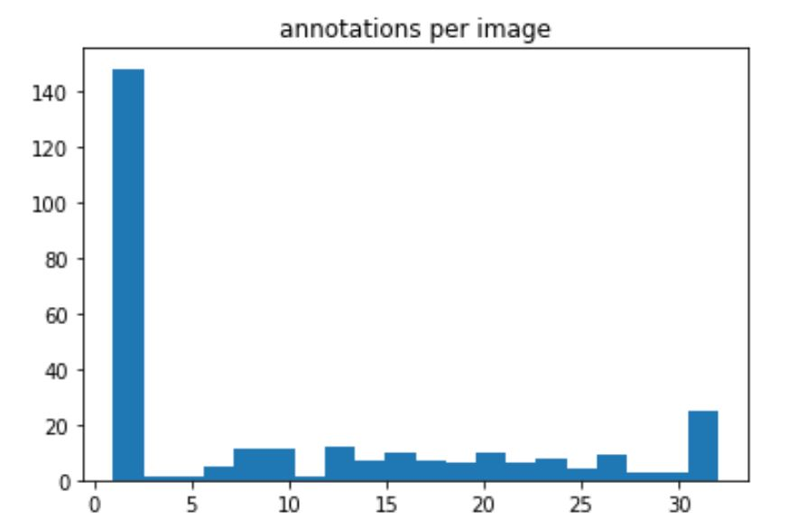

# Chess Classification Homework

  *Dataset compliments of [Roboflow](https://roboflow.ai/)* 

Building an image classification pipeline with chess pieces. The *general machine learning* question we will address here:
      
> How to build a classification model that transfers well to targets slightly different from train set? Or, what is the minimal effort to perform this transfer?

*Questions / Investigations:*

 - Can you predict piece class on white peices when only trained on black?

 - How well does a model trained on standard peices perform on slighly non standard pieces (referred to as "wooden pieces"?

 - What happens with piece occlusion?

 | Trainging Targets  | Test-Set Targets |
| --- | --- | 
|   *"regulation dataset"* |   *"wooden dataset"*|
|  |  

TODO - add bing dataset and glass piece dataset

##### Overview of Lessons Learned

This task seemed eminently do-able before I started and after working on it  awhile, realized it is quite difficult if not impossible, which helps me get a better perspective on how to structure *data-collection*, *model-building*, and *task-definition* in computer vision.

I see a corrolary to how naivete of non-programmers when they first learn how a computer executes instructions. There's a common classroom exercise of defining the "algorithm" of making scrambled eggs. Non-programmers forget the devil is in the details - like what to do with the shells once you crack the egg, how many times to beat the egg, etc. In the same manner,I have an intuitive algorithm for classifying what each piece in a non-regulation chess set represents, but it doesn't suit the style of model we're building here.

TODO - breakout the failures of model building, data collection, and task-definition, as it pertains to piece classification. 

TODO - could a human even tell 

----
### Resources

| Topic | Description | Link |
| --- | --- | --- |
| EDA | Analyze the annotated *Regulation Piece* dataset; join `Categories`, `Images`, and `Annotations` tables from COCO annotation. | [`eda_2.ipynb`](./eda_@.ipynb)|
| Cropping Script | use COCO annotations to crop individual pieces | [`crop_script_v1.py`](./crop_script_v1.py)|
| Training Notebooks | Fit different chess-piece datasets:   - Bing Image Search: 150 "X chess pieces", X = "bishop", "knight", "pawn"   - Regulation Pieces: from roboflow annotated dataset |   [Bing-Pieces-1](./clas_Exercise_1.ipynb)   [Regulation-Pieces-1](./clas_exercise_2.ipynb)|
| Production App | Run web-cam and make inference outside a notebook.   A simple client/server achitecture script. | [Link to repo `/app`](./app/)|
| Download Train Images | Use bing image api to download image datasets| [`bing_search_img.ipynb`](./bing_search_img.ipynb)|
| Scrap / Demo books | Various notebooks and scripts to demonstrate small points or explore concepts| |

---
### Dataset / EDA

Public dataset [here.](https://public.roboflow.ai/object-detection/chess-full) which includes images + annotations + data-augmentation

| Images / Annotations | Classes / Annotations |
| --- | --- |
| Roughly 300 standardized images of a chess board contain roughly 3,000 separate pieces .  | annotations with 100 - 200 annotations of each *{Piece-Class, Player-Color}*  |
|||

------
### Build Cropped Images

Convert the photos of the full board with (possibly) many pieces to one bounded using the built using this script.

| Input | Output |
| --- | --- |
|  |  | 

TODO - add a Clean images dataset

### Train Models

Following the class exercise's direction, ResNet18 seems to work exceedingly well for this task: Almost perfect results for the Regulation pieces, and not results considering the Bing dataset pieces often are so different (e.g. from rare or exotic chess ets) as to not to be human recognizable either.

| Regulation Dataset | Bing Dataset 1 |
| --- | --- |
|  |  | 

### Local real-time production app

This app runs "real time" meaning the webcame is always on and the app is making a prediction based on content (inside the yellow bounding box) every 2 seconds (configurable).

This uses a client/local-server architecture. The reason is I run my `fastai2` conda environment in WSL (linux virtual machine) but I can't use that for grabbing frames from my webcam. Therefore the client runs in windows and handles the `opencv` and webcam stuff and posts image data (via `requests`) to a flask server running in WSL which has a trained `learner` loaded and can predict the class of the piece.

Open Questions / Tasks:
 - how to display predict_proba for each class in matplotlib in a non-blocking fashion?
 - extend this to a remote server

### Train on DatasetA - Test on DatasetB

Here we assess (by eye) the performance of models trained on the Bing2 dataset and the regulation dataset when applied to the wooden dataset.

*Knight* is well predicted, *Rook* is pretty well detected, The decision of whether a piece is either a *Bishop* or *Pawn* is pretty well detected, but we can't distiniuigh between the two.

The most difficult is detecting the *King* and *Queen* and their distinction. One reason is because the wooden king lacks a cross on its head.

| Bing Dataset 2 | Regulation Dataset |
| --- | --- |
|  |  | 

*Open Questions / Tasks*
 - how to "subtract" the background prediction from the object's prediction?
 - perform on glass pieces