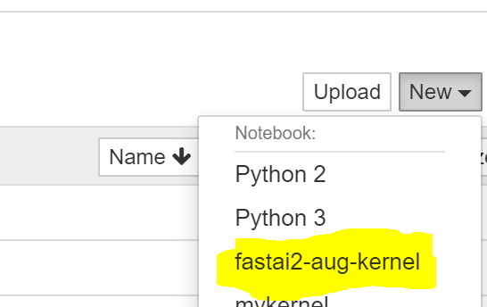

# Fastai2 Development / Operations Tips / Minor Projects


Use this repo to track tips and tricks for testing, versioning, pull requests , etc.

Remote VM's concentrated on GCP, but other option documentation welcome for pull-requests.

> Last updated 3.23.20

## Repository Contents

**Demo Projects**

| Work | Link |
| --- | --- |
| Style Transer Homework | [project repo](./style-transfer-hw) |
| Chess Classification Homework | [project repo](./chess-classification-hw) |


**Development Issue**

| Topic | Description | Link |
| --- | --- | --- |
| Versioning | Conda for dependecies | [Link](./readme.md#Versioning)|
| Testing | Test utilities | [Link](./readme.md#Testing)|

---

## Versioning

**Initial Install**

```
conda install -f environment.yml
```

Don't forget to activate your environment for 
```
conda activate fastai2
```

Check if your notebook matches a baseline environment. Use the following command to output a comprehensive list of your environment's configuration.

```
(fastai2) $ conda list > username-fastai2.condalist
```

Put your condalist file in the same directory as the baseline environment file [`sutt-fastai2-2.11.20.condalist`](./env/sutt-fastai2-2.11.20.condalist) Then use `git diff` to compare your environment to the baseline:

```
$ git diff --no-index sutt-fastai2-2.11.20.condalist username-fastai2.condalist
```

You will probably see some differences like below, we'll handle that in the next section. The main ones you need to worry about for specific versions are `pillow`, `torch`, and `torchvision`.

#### Updating environment

**Executing Jupyter remotely with Conda Environment**

If you use the following command to ssh / run interactive notebooks hosted on GCP:

```
$ gcloud compute ssh --zone=$ZONE jupyter@$INSTANCE_NAME -- -L 8080:localhost:8080
```

You probably won't be able to run notebooks in the fastai2 conda environment you just created, meaning you want be able to import the packages you just instaled into your code. To fix this, use an `ipykernel` and  `nb_conda` hack. On remote GCP run:

```
(base)    $ conda activate fastai2
(fastai2) $ conda install nb_conda
(fastai2) $ python -m ipykernel install --user --name fastai2-kernel
```

Now restart your ssh connection. In jupyter `notebook` you should see an option to create new notebooks with your kernel, you should be able to change kernels in an opened notebook, and in jupyter `lab` you should see the ability to start notebooks with your kernel:

| New Notebook | Change Notebook Kernel | Lab: Kernel Select |
| --- | --- | --- |
 |  |  |


**Enabling GPU**

---

## Testing

**Basics**

Run this command to execute tests and have their output print to two logfiles in a separate directory. 
```
(fastai2) parent/fastai2$ nbdev_test_nbs > ../testlog/stdout.rawlog 2> ../testlog/stderr.rawlog
```

This is useful when you suspect more then a couple test will fail because each failure is verbose, is difficult to search in terminal, and in a log can be reviewed later or on another machine.

This outputs stdout to `stdout.rawlog` which contains all the detailed printouts of test failures:

1. assertion errors / run-time exceptions messages
2. stack traces
3. the code of the cell that failed
4. names on notebooks initializaed for testing (*note: tests run in parrallel so it is difficult to know which notebook is connected to which failed cell*)

This outputs stderr to a separate file, `stderr.rawlog` which shows:
1. jupyter-based logging (usually extension based warnings/exceptions if executed on a headless remote (?))
2. the list of notebooks with at least one cell failure (at the end of the file).


Although stdout show up nicely in linux terminal, they show ugly in a text editor. You can view the *Pretty* color-annotated test output with `$ cat stdout.rawlog` to print to terminal (or by running tests without piping). You view the *Ugly* by viewing the .rawlog file with `less` or `vscode`. In the next section we show how to view the .log file shown in  *Fixed*.


| Pretty | Ugly | Fixed |
| --- | --- | --- |
| `cat stdout.rawlog` | `less stdout.rawlog` | `less stdout.log` |
|  |  | 

**Utilities**

To format the testing errors nicely, run the bash script [`linux-esc-script.sh`](./scripts/linux-esc-script.sh):

```
(fastai2) testlog$ ./linux-esc-script.sh stdout.rawlog > stdout.log 
```
stdout.log should now appear as it does in *Fixed* image in the table above when viewed in a text editor.

The script runs the following `sed` regex to escape control characters and color characters:

```
sed -r "s/\x1B\[([0-9]{1,2}(;[0-9]{1,2})?)?m//g"  | \
sed -r "s/\x1B\[.*G//g" | \
sed 's/[[:cntrl:]]//g' 
```

**Passes & Failing**

