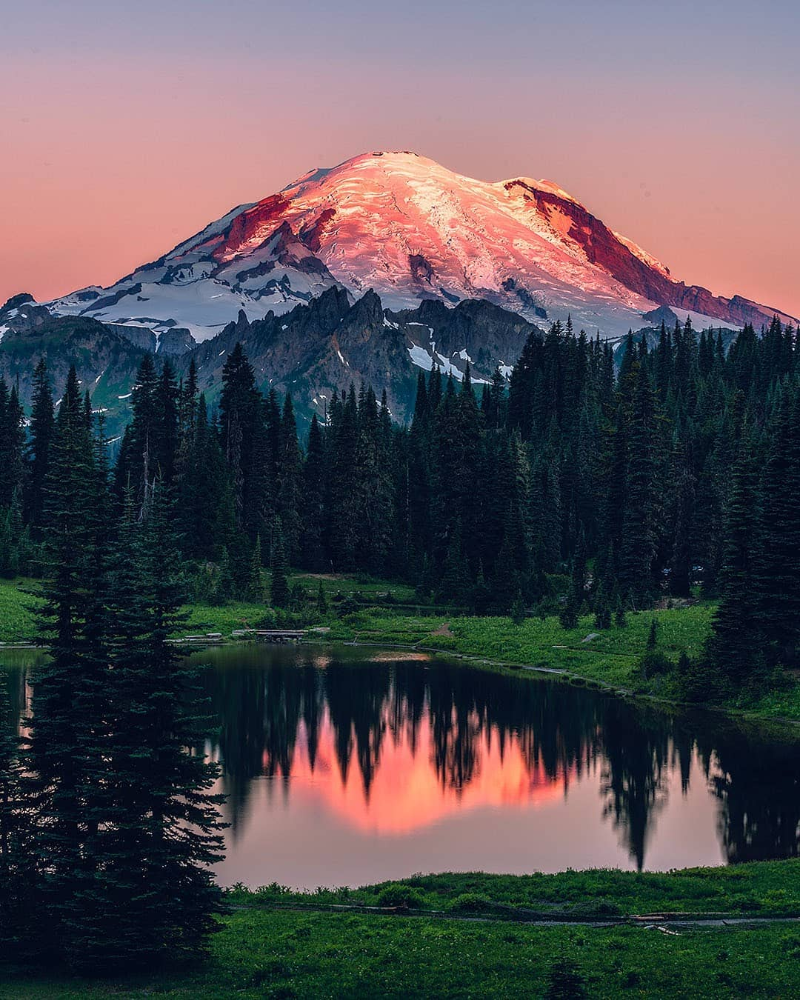
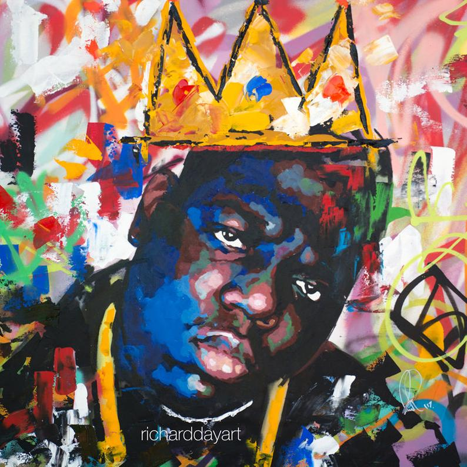
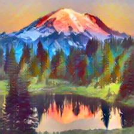
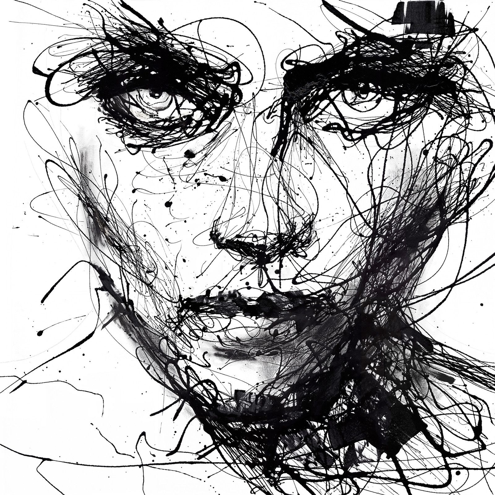
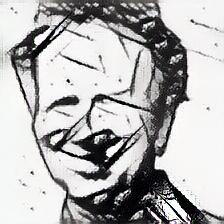
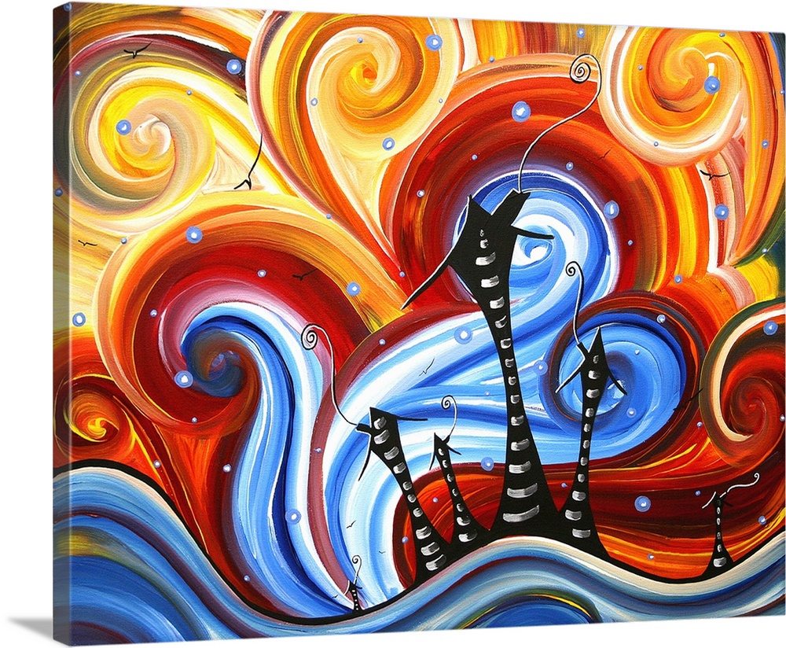
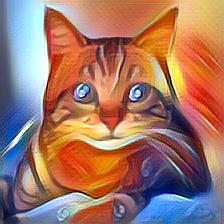

### Style Transfer Homework
-----
**Abstract:** Applying the results of the FastAI style lectures from [Jeremy Howard](https://www.youtube.com/watch?v=xXXiC4YRGrQ) and [Zach Mueller](https://www.youtube.com/watch?v=4w3sEgqDvSo) with `fastai_v2`

**Results:**
We build four style models (abstract, biggie, ink, watercolor) and apply each against four target contents. The two most artistically succesful images are:
 - biggie style applied to mountain
 - abstract style applied to cat

| Original | Style | Modified |
| --- | --- | --- |
||||
||||
||||

Strange results with ink in the distortion of content faces. Perhaps the style network fails to recognize the style image as a face? It seems it definetly does not capture the style of "messy pen" and instead reverts to something like cubism with charcoal pencil.

Dissapointing results with watercolor, this points to watercolor not being captured well by this Graham matrix matching method. Another problem, the system relies on one color style too heavily. Surprisingly, applying a water color of a landcape as a style to a landscape photograph doesn't work well, while applying the the style of a "hip hop" painting does work well.

Most intriguing result is the selective shading of African and Caucasian skin tone. "Biggie" style comes from a abstract painting of an black artist where the skin is stylized with deep blue tones. When applying this style to even a black and white photograph of an african (again, "Biggie Smalls") the deep blue is transfered to his face. Meanwhile for caucasian skin tone (pictured, Jeremy Howard) this style does not bestow any blue onto his skin. Caveats: 
 - sample size greater than two needed, 
 - need to test content photographs in both color and black&white
 - the abstract style also shades black faces with blue and white faces with orange

---

**Resources:**

| Topic | Description | Link |
| --- | --- | --- |
| Training Models | notebooks for training style models | [ink](./train_ink.ipynb), [biggie](./train_biggie.ipynb),  [watercolor](./train_watercolor.ipynb)|
| Result Tabulation | notebooks for formatting results | [style-transfer-results.ipynb](./style_transfer_results.ipynb)|
| Scratch Book | converting original lesson to my own | [demo_load_model.ipynb](./demo_load_model.ipynb)|
| Original Lesson | zach's lesson with addtions | [original_lesson.ipynb](./original_lesson.ipynb)|
| Helper Functions | .py files for each function | [`suttstyle.py`](./imports/suttstyle.py)|
| Images | the image files input / output | [`imgs/`](./imgs/)|
| Learned Skill | get an image out a dataloader  | [get_specific_image.ipynb](./get_specific_image.ipynb)|

----

**Results Grid**

Style targets across the top, Content targets along left side, content modified by style inner product.


----

**Summary of Method / Outline to reproduce**

**Other Resources**

 - [fastai alumni blog post](https://francescopochetti.com/fast-neural-style-transfer-training-the-model/)
 
 - [Style Transfer Paper, Gaty 2015](https://arxiv.org/abs/1508.06576)
 
 - [Style Transfer Paper, Johnson2016](https://arxiv.org/abs/1603.08155)

----
**Small Wins**

Two areas came up that were important to address:
  -  How to get an un-transformed image out of a fastai DataLoader (get the transformed image is easy). The way to do this is found in [get_specific_image.ipynb](./get_specific_image.ipynb).
    
    
  - How to save or plot images in various stages of the dataloader / model pipeline:
```python
    from PIL import Image
    def save_image(pred_image, content_num, style_num):
        out = np.uint8(pred_image)
        out = np.transpose(out, (1,2,0))
        img = Image.fromarray(out)
        img.save(fn.jpg')
```
----

**Remaining Questions / Further Improvements**
 
 - Why do we need to train a style model on all of image net?

 - What parameter controls the tradeoff in loss from style vs tradeoff in loss from content (like lambda in regression regularization).
 
 - How would these results be different if we took different layers?
 
 - Need to crop the original content images before.