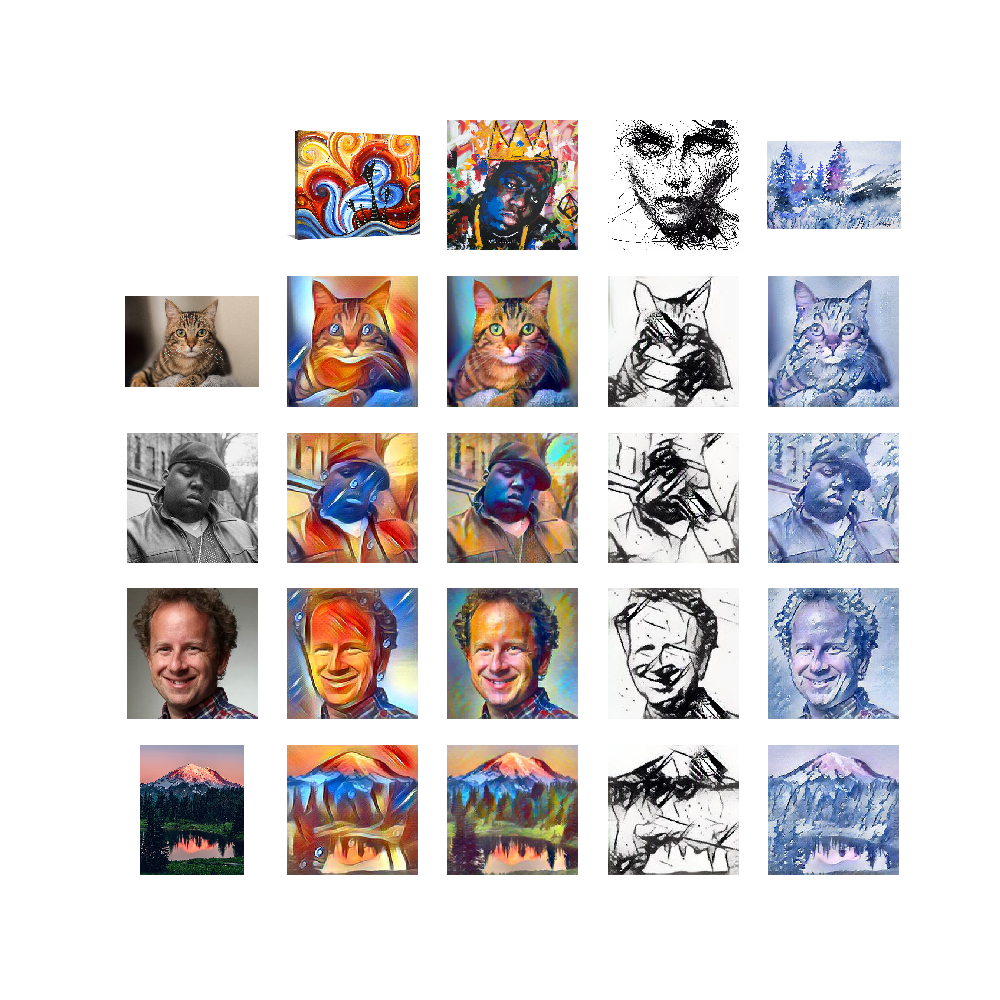

### Style Transfer Results

**Abstract:** Applying the results of the FastAI style lectures from [Jeremy Howard](https://www.youtube.com/watch?v=xXXiC4YRGrQ) and [Zach Mueller](https://www.youtube.com/watch?v=4w3sEgqDvSo) with `fastai_v2`

**Resources:**

| Topic | Description | Link |
| --- | --- | --- |
| Training Models | notebooks for training style models | [ink](./train_ink.ipynb) [biggie](./train_biggie.ipynb) [watercolor](./train_watercolor.ipynb)|
| Result Tabulation | notebooks for formatting results | [style-transfer-results.ipynb](./style_transfer_results.ipynb)|
| Scratch Book | converting original lesson to my own | [demo_load_model.ipynb](./demo_load_model.ipynb)|
| Original Lesson | zach's lesson with addtions | [original_lesson.ipynb](./original_lesson.ipynb)|
| Helper Functions | .py files for each function | [`suttstyle.py`](./imports/suttstyle.py)|
| Images | the image files input / output | [`imgs/`](./imgs/)|
| Learned Skill | get specifc image  | [get_specific_lesson.ipynb](./get_specific_lesson.ipynb)|

----

**Results Grid**

Style targets across the top, Content targets along left side, content modified by style inner product.

----

**Summary of Method / Outline to reproduce**

**Other Resources**

 - [fastai alumni blog post](https://francescopochetti.com/fast-neural-style-transfer-training-the-model/)
 
 - [Style Transfer Paper, Gaty 2015](https://arxiv.org/abs/1508.06576)
 
 - [Style Transfer Paper, Johnson2016](https://arxiv.org/abs/1603.08155)

**Highlights / Interesting Findings**

**Small Wins**

**Remaining Questions / Further Improvements**
 - Why do we need to train a style model on all of image net?

